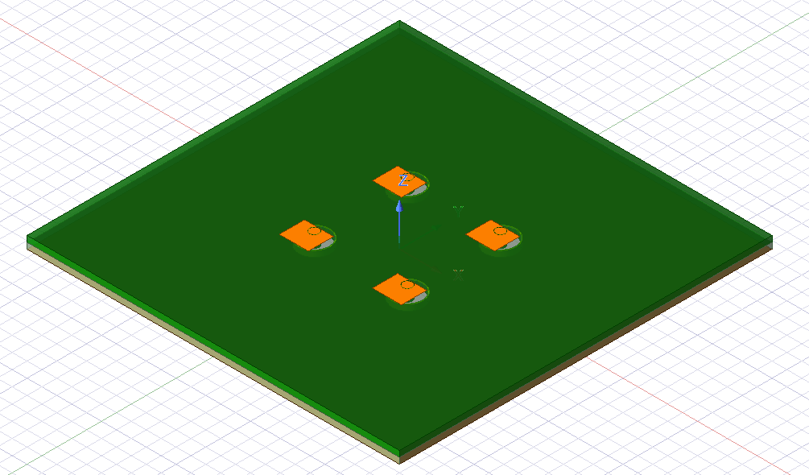

# 📡 Microstrip Patch Antenna Array 2×2

This project involves the design and simulation of a 2×2 microstrip patch antenna array using Ansys HFSS.  
The array is optimized for operation around 2.4 GHz, suitable for applications such as Wi-Fi, Bluetooth, and other ISM band communications.

---

## 📁 Repository Contents

- `MPA_2x2.aedt` – HFSS project file containing the antenna array design and simulation setup.
- `Microstrip Patch Antenna Array - 2x2.pdf` – Comprehensive documentation detailing the design process, simulation results, and analysis.
- `README.md` – This documentation file.

---

## 📐 Antenna Design Specifications

- **Array Configuration:** 2×2 rectangular patch elements
- **Operating Frequency:** ~2.4 GHz
- **Substrate Materials:**
  - Top Layer: Rogers 4350 (εr ≈ 3.48), 0.8 mm thickness
  - Bottom Layer: FR4 (εr ≈ 4.4), 0.8 mm thickness
- **Substrate Dimensions:** 50 mm × 50 mm
- **Element Spacing:** 12.5 mm center-to-center
- **Feeding Mechanism:** Each patch is individually fed using a vertical SMA connector

---

## 🛠️ Getting Started

### Prerequisites

- **Ansys HFSS** (required to open and simulate the `.aedt` file)  
  👉 [Download Ansys HFSS](https://www.ansys.com/products/electronics/ansys-hfss)

### Running the Simulation

1. Open `MPA_2x2.aedt` in HFSS
2. Inspect geometry, boundary setup, and solution setup
3. Run simulation and analyze:
   - Return loss (S11)
   - Gain
   - Radiation pattern

---

## 📊 Simulation Results

Key metrics you can extract from the HFSS simulations:

- **S-Parameters (Return Loss S11)** – Indicates impedance matching at 2.4 GHz
- **Radiation Pattern** – Directional gain distribution
- **Antenna Gain** – Efficiency and amplification toward the main lobe

Refer to the full report here:  
📄 [`Microstrip Patch Antenna Array - 2x2.pdf`](./Microstrip%20Patch%20Antenna%20Array%20-%202x2.pdf)

---

## 📷 Antenna Layout Diagram

Below is a schematic representation of the 2×2 microstrip patch antenna array:

